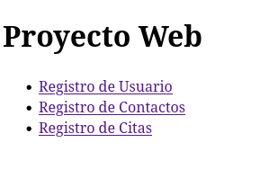
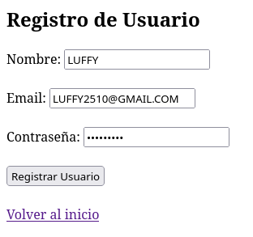
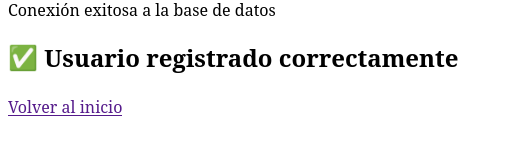
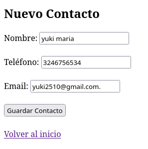
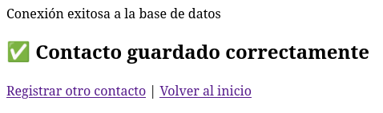
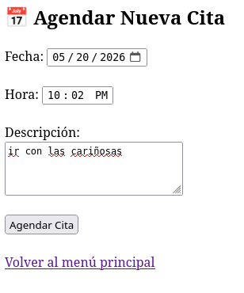
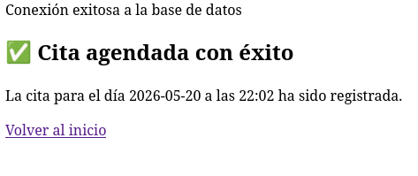

# Proyecto 01 — Mini-aplicación web

## Objetivo del proyecto

Desarrollar una mini-aplicación web aplicando los conocimientos básicos de la materia de Desarrollo de Aplicaciones Web.

## Problema que resuelve

Este proyecto permite practicar la creación de una aplicación web sencilla, integrando estructura, diseño y funcionamiento básico mediante tecnologías web.

## Tecnologías utilizadas

- HTML
- CSS
- PHP
- Navegador web
- Git
- GitHub

## Conceptos aplicados

- Estructura de una página web.
- Organización de archivos.
- Uso de formularios.
- Desarrollo de interfaz web.
- Documentación del proyecto.
- Control de versiones con GitHub.

## Explicación del funcionamiento

La mini-aplicación web funciona mediante archivos organizados dentro de la carpeta del proyecto. El código fuente se encuentra en la carpeta `codigo`, mientras que las evidencias y capturas de pantalla se colocan en la carpeta `capturas`.
## Capturas de pantalla

### Pantalla principal

### Registro de usuario

### Usuario registrado correctamente

### Nuevo contacto

### Contacto guardado correctamente

### Agendar cita

### Cita agendada correctamente

