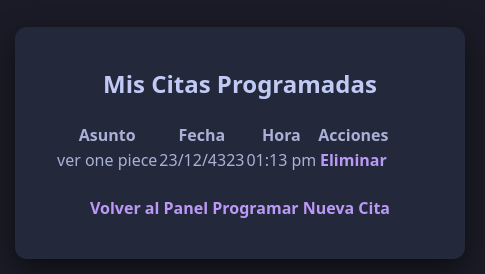

# Proyecto 03 — Sistema de citas

## Objetivo del proyecto

Desarrollar una aplicación web para registrar, organizar y administrar citas mediante una interfaz sencilla.

## Problema que resuelve

Este proyecto permite llevar un control de citas, evitando la pérdida de información y facilitando la administración de registros desde una aplicación web.

## Tecnologías utilizadas

- HTML
- CSS
- PHP
- MySQL
- Git
- GitHub
- Navegador web

## Conceptos aplicados

- Formularios web.
- Conexión a base de datos.
- Registro de información.
- Administración de citas.
- Organización de archivos.
- Control de versiones con GitHub.

## Explicación del funcionamiento

El sistema de citas permite capturar información mediante formularios y administrar los registros guardados. El código fuente se encuentra dentro de la carpeta `codigo/cita`, mientras que las evidencias del funcionamiento deben colocarse en la carpeta `capturas`.

## Estructura del proyecto

```text
Proyecto_03_Sistema_de_citas/
├── codigo/
│   └── cita/
├── capturas/
└── README.md
## Capturas de pantalla

### Registro de usuario


### Inicio de sesión


### Panel principal


### Crear cita


### Cita registrada


### Lista de citas

