# Proyecto 04 — Portafolio en WordPress

## Objetivo del proyecto

Crear un portafolio web utilizando WordPress, con el propósito de presentar información personal, académica o profesional mediante un sitio administrable.

## Problema que resuelve

Este proyecto permite crear un sitio web sin programar todo desde cero, utilizando WordPress como gestor de contenido para organizar páginas, entradas, imágenes y secciones informativas.

## Tecnologías utilizadas

- WordPress
- HTML
- CSS
- PHP
- Navegador web
- Git
- GitHub

## Conceptos aplicados

- Instalación y configuración de WordPress.
- Uso de temas.
- Personalización de páginas.
- Gestión de contenido.
- Organización de archivos.
- Documentación de evidencias.

## Explicación del funcionamiento

El portafolio fue desarrollado mediante WordPress utilizando un tema personalizado o adaptado. El sitio permite mostrar información organizada en diferentes secciones. El código o archivos del tema se encuentran en la carpeta `codigo/energoserver-portfolio`, mientras que las capturas del sitio funcionando deben colocarse en la carpeta `capturas`.

## Estructura del proyecto

```text
Proyecto_04_Portafolio_WordPress/
├── codigo/
│   └── energoserver-portfolio/
├── capturas/
└── README.md
## Capturas de pantalla

### Captura 1
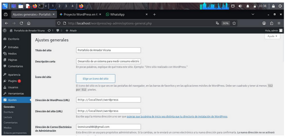

### Captura 2
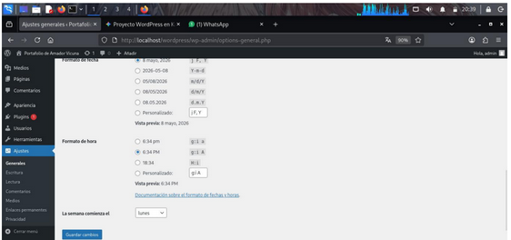

### Captura 3
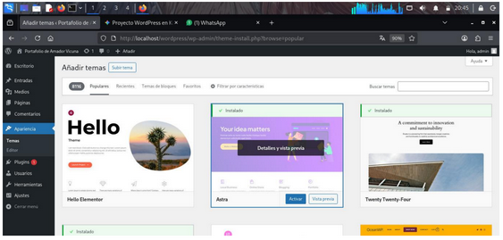

### Captura 4
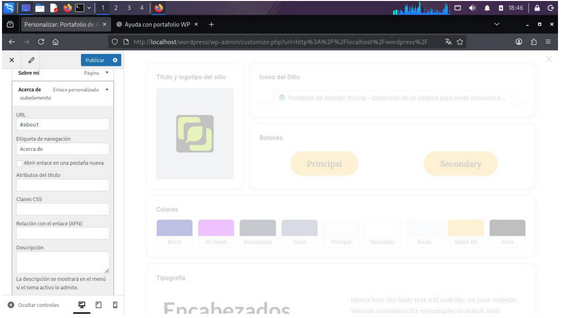

### Captura 5
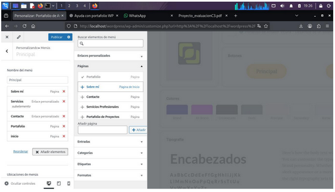

### Captura 6
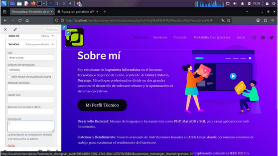

### Captura 7
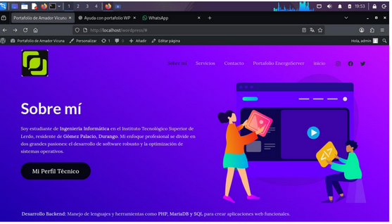

### Captura 8
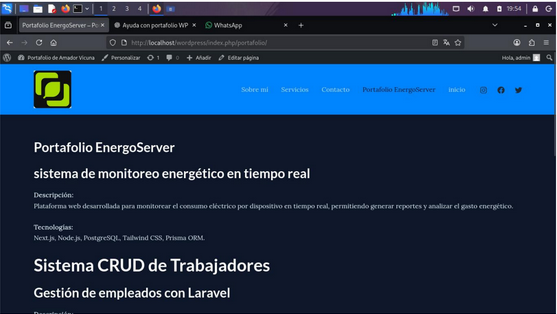

### Captura 9
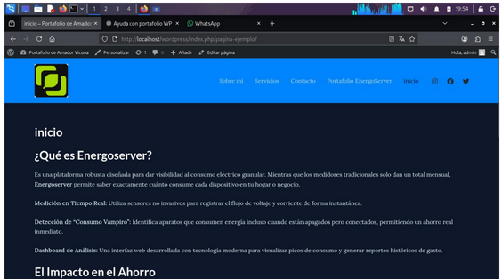

### Captura 10
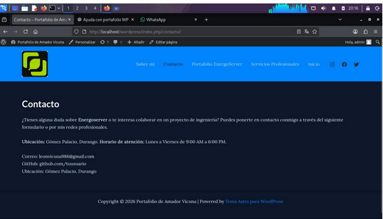

### Captura 11
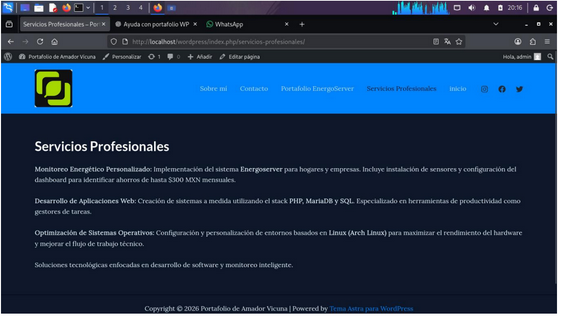

### Captura 12
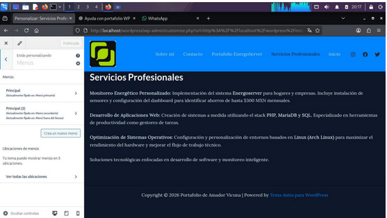

### Captura 13
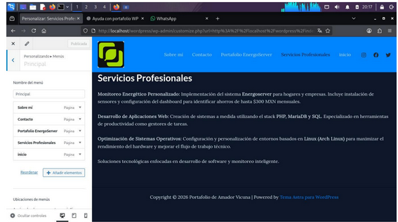

### Captura 14
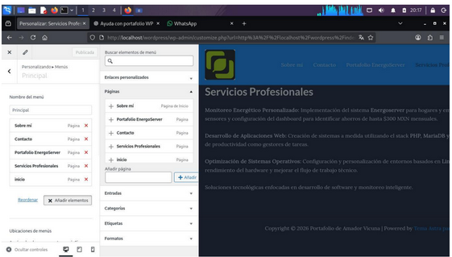

### Captura 15
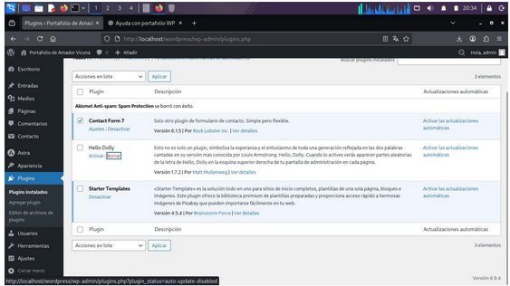
