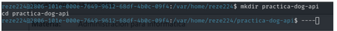
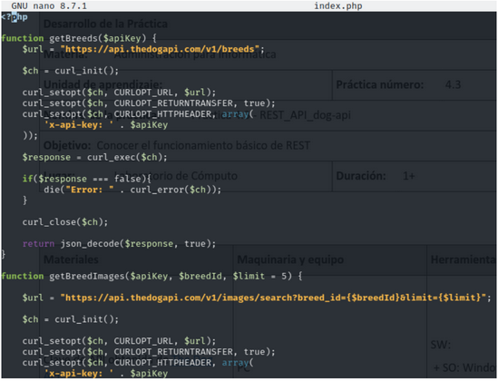
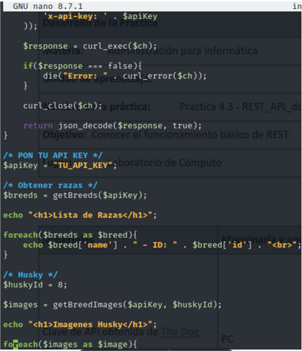
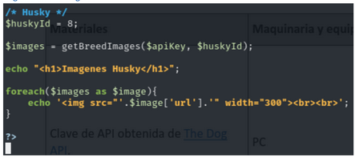
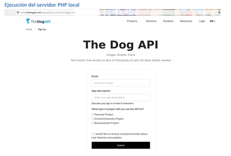
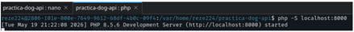
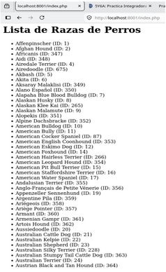
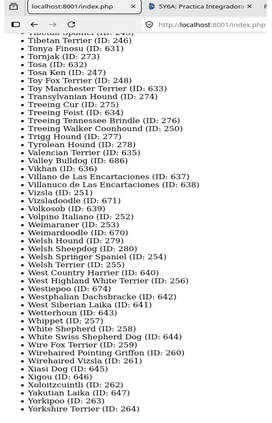
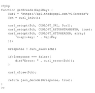

# Proyecto 05 — REST API Dog API

## Objetivo del proyecto

Desarrollar una aplicación web que consuma una API REST para obtener información de razas de perros e imágenes relacionadas utilizando PHP y cURL.

## Problema que resuelve

Este proyecto permite practicar el consumo de servicios externos mediante una API REST, mostrando datos obtenidos desde internet dentro de una aplicación web.

## Tecnologías utilizadas

- HTML
- CSS
- PHP
- cURL
- API REST
- The Dog API
- Git
- GitHub
- Navegador web

## Conceptos aplicados

- Consumo de API REST.
- Uso de peticiones HTTP.
- Manejo de respuestas JSON.
- Uso de cURL en PHP.
- Integración de datos externos.
- Organización de archivos.
- Documentación técnica.

## Explicación del funcionamiento

La aplicación realiza peticiones a The Dog API para obtener una lista de razas de perros y mostrar información relacionada. Mediante PHP y cURL se realiza la conexión con la API, se procesa la respuesta en formato JSON y se presenta el contenido en el navegador.

El código fuente se encuentra dentro de la carpeta `codigo/practica-dog-api`, mientras que las evidencias del funcionamiento deben colocarse dentro de la carpeta `capturas`.

## Estructura del proyecto

```text
Proyecto_05_REST_API_dog_api/
├── codigo/
│   └── practica-dog-api/
├── capturas/
└── README.md
## Capturas de pantalla

### Captura 1


### Captura 2


### Captura 3


### Captura 4


### Captura 5


### Captura 6


### Captura 7


### Captura 8


### Captura 9


### Captura 10

